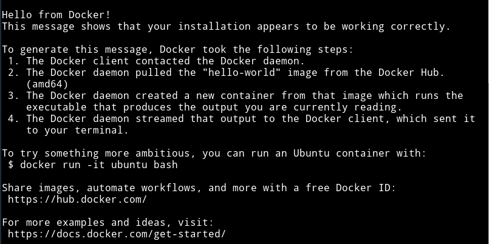
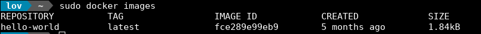

# Docker

## 简介

### 理念

​	Docker基于Go语言实现的云开源项目。

​	Docker主要目标是“Build，Ship and Run Any App，Anywhere”（一次封装，到处运行）

​	解决运行环境和配置问题，方便做持续集成并有助于整体发布的容器虚拟化技术

### 作用

#### 	虚拟化

​	Docker与传统虚拟化方式区别：

- 传统虚拟机技术是虚拟出一套硬件后，在其上运行一个完整操作系统，在该系统上再运行所需的应用程序

- 容器的应用进程直接运行与宿主的内核，容器内没有自己的内核，而且也没有进行硬件虚拟。因此容器比传统虚拟机更为轻便

- 每个容器之间相互隔离，每个容器有自己的文件系统，容器之间进程不会相互影响，能区分计算资源

####	开发/运维（DevOps）

​	一次构建，随处运行

- 更快速的应用交付与部署
- 更便捷的升级与扩缩容
- 更简单的系统运维
- 更高效的计算资源利用

### Docker三要素

#### 镜像（Image）

​	一个只读的模板。镜像可以用来创建Docker容器，一个镜像可以创建多个容器

#### 容器（Container）

​	容器是用镜像创建的运行实例，它可以被启动、开始、停止、删除。每个容器都是相互隔离，保证安全的平台

​	可以将容器看做是一个简易版的Linux环境和运行在其中的应用程序

​	容器的定义与镜像几乎一样，也是一堆层的统一视角，唯一区别在于容器的最上面那一层是可读可写的

#### 仓库（Repository）

​	集中存放镜像文件的地方。

​	仓库注册服务器上存放多个仓库，每个仓库又包含多个镜像，每个镜像有不同的标签

​	国内的公开仓库：阿里云、网易云等

## Docker安装

​	1、安装必要的软件包以允许apt通过HTTPS使用存储库

```shell
sudo apt-get install apt-transport-https ca-certificates curl software-properties-common
```

​	2、添加GPG密钥，可以添加官方的和阿里的（国内镜像更快）

```shell
// 官方
curl -fsSL https://download.docker.com/linux/ubuntu/gpg | sudo apt-key add -
// 阿里
curl -fsSL https://mirrors.aliyun.com/docker-ce/linux/ubuntu/gpg | sudo apt-key add -
```

​	3、命令验证

```sehll
sudo apt-key fingerprint 0EBFCD88
```

​	4、正常返回结果

```shell
pub   rsa4096 2017-02-22 [SCEA]
      9DC8 5822 9FC7 DD38 854A  E2D8 8D81 803C 0EBF CD88
uid           [ unknown] Docker Release (CE deb) <docker@docker.com>
sub   rsa4096 2017-02-22 [S]
```

​	5、设定稳定仓储库

```shell
sudo add-apt-repository "deb [arch=amd64] https://mirrors.aliyun.com/docker-ce/linux/ubuntu $(lsb_release -cs) stable"
```

​	6、安装docker

```shell
sudo apt-get update
sudo apt-get -y install docker-ce
```

​	**安装指定版本**

​	1、先查看版本

```shell
apt-cache madison docker-ce
```

​	2、安装

```shell
sudo apt-get install -y docker-ce=<VERSION>
```

### 配置

#### 	配置文件

​	Ubuntu中，docker的配置文件为`/etc/default/docker`


#### 	开启服务

​	`service docker start` / `sudo systemctl start docker`

​	查看相关信息

​	`docker verison`


#### 	配置阿里云镜像加速

1、**注册阿里云账号**

2、**获取加速器地址配置**

`https://cr.console.aliyun.com/cn-hangzhou/instances/mirrors`

```shell
sudo mkdir -p /etc/docker
sudo tee /etc/docker/daemon.json <<-'EOF'
{
  "registry-mirrors": ["https://g5wqxm6c.mirror.aliyuncs.com"]
}
EOF
sudo systemctl daemon-reload
sudo systemctl restart docker
```

#### HelloWorld

```shell
docker run hello-world
```



### 底层原理（简单说明）

​	Docker是一个Client-Server结构的系统，Docker守护进程运行在主机上，然后通过Socket连接从客户端访问，守护进程从客户端接受命令并管理运行在主机上的容器。容器是一个运行时环境。

​	Docker有比虚拟机更少的抽象层。由于Docker不需要Hypervisor实现硬件资源虚拟化，运行在docker容器上的程序直接使用的都是实际物理机的硬件资源。因此在cpu、内存利用率上docker将会有明显优势。

​	Docker利用的是宿主机的内核，而不需要Guest OS。因此，当新建一个容器时，Docker不需要和虚拟机一样重新加载一个操作系统内核。然而避免引寻、加载操作系统内核是个比较费时费资源的过程，当新建一个虚拟机时，虚拟机软件需要加载Guest OS，整个新建过程是分钟级别。而Docker由于直接利用宿主机的操作系统，则省略了这个过程，因此新建一个Docker容器仅需几秒。

|            | Docker容器         | 虚拟机                 |
| ---------- | ------------------ | ---------------------- |
| 操作系统   | 与宿主共享         | 宿主机OS上运行虚拟机OS |
| 存储大小   | 镜像小             | 镜像庞大               |
| 运行性能   | 几何无额外性能损耗 | 额外CPU、内存损耗      |
| 移植性     | 轻便、灵活         | 与虚拟化技术耦合度高   |
| 硬件亲和性 | 面向软件开发       | 面向硬件运维           |

## Docker常用命令

### 帮助命令

`docker version`

`docker info`

`docker --help`

### 镜像命令

---

列出本地主机上的镜像 ：`docker images`  



>REPOSITORY：镜像的仓库源
>TAG：镜像的标签
>IMAGE ID：镜像ID
>CREATED：镜像创建时间
>SIZE：镜像大小

​	== 同一仓库源可以有多个TAG，代表这个仓库源的不同版本，使用REPOSITORY:TAG来定义不同的镜像 ==

​	**options：**

> -a ：列出本地所有的镜像
> -q：只显示镜像ID
> --digests：显示镜像的摘要信息
> --no-trunc：显示完整的镜像信息

---

`docker search 镜像名`

​	http://hub.docker.com上查询镜像

​	**options：**

>--no-trunc：显示完整的镜像描述
>-s：列出收藏数不小于指定值的镜像
>--automated：只列出automated build类型的镜像

---

 下载镜像：`docker pull 镜像名` 

---

删除镜像：`docker rmi 镜像ID`

删除全部镜像：`docker rmi -f $(docker images -qa)`

### 容器命令

新建并启动容器：`docker run [OPTIONS] image [COMMAND [ARG...]` 

​	**options:**

>--name="容器的新名称" ： 为容器指定一个名称
>
>-d：后台运行容器，并返回容器ID，即启动守护式容器
>
>-i：以交互模式运行容器，通常与-t 同时使用
>
>-t：为容器重新分配一个伪输入终端，通常与-i 同时使用
>
>-P：随机端口映射
>
>-p：指定端口映射，有一下四中格式
>
>​		ip:hostPort:containerPort
>
>​		ip::containerPort
>
>​		hostPort:containerPort
>
>​		containerPort


列出所有正在运行的容器：`docker ps [OPTIONS]` 

​	**options:**

>-a ：列出当前所有正在运行的容器+历史上运行过的
>
>-l ：显示最近创建的容器
>
>-n ：显示最近n个创建的容器
>
>-q ：静默模式，只显示容器编号
>
>-no-trunc ：不截断输出


退出容器： `exit（容器停止退出）/ctrl+p+q（容器不停止退出）`

启动容器：`docker start 容器ID/容器名` 

重启容器：`docker restart 容器ID/容器名`

停止容器：`docker stop 容器ID/容器名`

强制停止容器：`docker kill 容器ID/容器名`

删除容器：`docker rm 容器ID/容器名`

​				`docker rm -f $(docker ps -a -q)`

​				`docker ps -a -q | xargs docker rm`

启动守护式容器：`docker run -d 镜像`

>​	该方式启动容器后，通过`docker ps -a` 查看时，显示该容器已退出原因：
>
>​	这是docker的机制，容器为后台进程模式运行，就导致docker前台没有运行的应用，这样的容器后台启动后，会立即自杀，因为该容器会觉得自己没事做了，所以**Docker容器后台运行，就必须有一个前台进程**
>
>`docker run -d centos /bin/sh -c "while true;do echo hello docker;sleep 2;done"`：以后台进程启动容器后，调用容器中的sh执行后面的脚本，该方式运行后，容器进程不会自杀

查看容器日志：`docker logs -f -t --tail 容器ID`

>-t：加入时间戳
>
>-f：跟随最新的日志打印
>
>--tail 数字：显示最后多少条

查看容器内运行的进程：`docker top 容器ID`

查看容器内部细节：`docker inspect 容器ID`

进入正在运行的容器并以命令行交互：

​	1、`docker exec -it 容器ID bashShell`：该方式是在容器中打开新的终端，并且可以启动新的进程（该容器交互中，执行exit不会关闭容器，因为相当于关闭了以该方式新建的终端，并没有关闭容器启动命令的终端）

​	2、`docker attach 容器ID`：该方式直接进入容器启动命令的终端，不会启动新的进程


 从容器内拷贝文件到主机：`docker cp 容器ID:容器内路径  目标主机路径`

## Docker镜像

​	镜像是一种轻量级、可执行的独立软件包，用来打包软件运行环境和基于运行环境开发的软件，他包含运行某个软件所需要的所有内容，包括代码、运行时的库、环境变量和配置文件。

​	UnionFS（联合文件系统）是Docker镜像的基础。镜像通过分层来继承，基于基础镜像体（没有父镜像），可以制作各种具体的应用镜像。

### Docker镜像加载原理

>​	Docker的镜像实际上由一层一层的文件系统组成，这种层级的文件系统为UnionFS。
>
>​	bootfs（boot file system）主要包含bootloader和kernel。bootloader主要引导加载kernel，linux刚启动时会加载bootfs文件系统	，在Dokcer镜像的最底层是bootfs。这一层与典型的Linux/Unix系统一样，包含boot加载器和内核。当boot加载完成之后整个内核就都在内存中了，此时内存的使用权已由bootfs转交到内核，此时系统也会卸载bootfs。
>
>​	rootfs（root file system），在bootfs之上，包含的就是典型Linux系统中的/dev、/proc、/bin、/etc等标准目录和文件。rootfs就是各种不同的操作系统发行版。
>
>​	对于一个精简的OS，rootfs可以很小，只需要包括最基本的命令、工具和程序库，因为底层直接使用Host的kernel，本身只需要提供rootfs即可。

### 特点

>Docker镜像都是只读的
>
>当容器启动时，一个新的可写层被加载到镜像的顶部
>
>这一层通常被成为“容器层”，“容器层”之下的都叫“镜像层”

### commit操作

提交容器副本为一个新的镜像：`docker commit -m="提交的描述信息" -a="作者" 容器ID  创建的目标镜像名:[标签名]`

**案例：**

1、运行tomcat镜像生成容器
 ​	`docker run -it -p 8888:8080 tomcat`

 ​	将本地8888端口与容器中8080端口映射


 2、修改生产容器中的内容，如：删除tomcat中的docs


 3、以当前修改后的容器为模板，commit新镜像lov/tomcat01


## Docker容器数据卷

​	Docker容器产生的数据，如果不通过commit生产新的镜像，那么容器删除后，数据自然就没了。为了能保存数据在docker中，就使用卷。

​	卷能实现容器的持久化和容器间继承、共享数据

> ​	卷就是目录或文件，存在于一个或多个容器中，由docker挂载到容器，但不属于联合文件系统，因此能够绕过联合文件系统提供一些用于持续存储或共享数据的特性。
>
> ​	卷的设计目的就是数据的持久化，完全独立于容器的生存周期，因此Docker不会在容器删除时删除其挂载的数据卷
>
> ​	特点：
>
> ​	1、数据卷可子啊容器之间共享或重用数据
>
> ​	2、卷中的更改可以直接生效
>
> ​	3、数据卷中的更改不会包含在镜像的更新中
>
> ​	4、数据卷的生命周期一直持续到没有容器使用为止

### 容器内添加

#### 命令方式

​	`docker run -it -v /宿主机绝对路径目录:/容器内目录:权限 镜像名`

​	如果宿主机与容器内都没有对应的目录，会自动创建


​	通过`docker inspect` 查看该容器的挂载，默认当前容器的目录为读写


​	权限限制，限制的是容器中的目录权限，以下限制为只读权限，容器对其中的文件只读，当宿主机文件修改，容器对应文件也会改变。


#### DockerFile添加

​	1、新建dockerFile文件，在DockerFile中使用`VOLUME`指令给镜像添加一个或多个数据卷

```sh
FROM centos
VOLUME ["/dataTest1","/dataTest2"]
CMD echo "finished ,.........."
CMD /bin/bash
```

​		相当于`docker run -it -v /默认分配目录1:/dataTest1 -v /默认分配目录2:/dataTest2 centos /bin/bash`  

​	2、File构建

​	`docker build -f ./dockerFile  -t lov/centos:1.0 .`


​	3、run容器，`inspect`分析容器中目录对应的宿主机目录（默认分配目录）


### 数据卷容器

​	命名的容器挂载数据卷，其他容器通过挂载这个（父容器）实现数据共享，挂载数据卷的容器，称之为数据卷容器。

**--volumes-from**

​	`sudo docker run -it --name="a1" lov/centos:1.0`

​	`sudo docker run -it --name="a2" --volumes-from a1 lov/centos:1.0`

​	`sudo docker run -it --name="a3" --volumes-from a2 lov/centos:1.0`

​	a1、a2、a3三个容器，以a1为源头，一层层传递，三个容器的对应文件都是共享的，无论删除任意容器，重启后仍能共享。

​	该命令相当于指定当前容器中的卷目录对应的宿主机目录，与指定容器的宿主机目录一致。所以以上三个容器，共用同一个宿主机目录地址。

## DockerFile解析

​	DockerFile是用来构建Docker镜像的构建文件，是由一系列命令和参数构成的脚本。

​	构建步骤：编写dockerfile文件 -> docker build -> docker run 	


### DockerFile构建过程解析

#### DockerFile内容基础知识

>1、每条保留字指令都必须为大写字母，且后面要跟随至少一个参数
>
>2、指令按照从上到下，顺序执行
>
>3、#表示注释
>
>4、每条指令都会创建一个新的镜像层，并对镜像进行提交

#### Docker执行DockerFile的大致流程

>1、Docker从基础镜像运行一个容器
>
>2、执行一条指令并对容器作出修改
>
>3、执行类似`docker commit`的操作提交一个新的镜像层
>
>4、docker再基于刚提交的镜像运行一个新容器
>
>5、执行dockerfile中的下一条指令，直到所有指令都执行完成

#### 关系总结

​	从应用软件角度看：

>DockerFile是软件的原材料
>
>Docker镜像是软件的交付品
>
>Docker容器则是软件的运行态

​	总结：

>1、DockerFile定义了进程需要的一些东西。DockerFile涉及的内容包括执行代码或是文件、环境变量、依赖包、运行时环境、动态链接库、操作系统的发行版、服务进程和内容进程等等。
>
>2、Docker镜像，在用DockerFile定义一个文件后，`docker build`时会产生一个Docker镜像，当运行Docker镜像时，会真正开始提供服务
>
>3、Docker容器，容器直接提供服务

### DockerFile保留字指令

​	**FROM**：基础镜像，当前镜像是基于哪个镜像的

​	**MAINTAINER**：镜像维护者的姓名和邮箱地址

​	**RUN**：容器构建是需要运行的命令

​	**EXPOSE**：当前容器对外暴露的端口

​	**WORKDIR**：指定在创建容器后，终端默认登录进来的工作目录

​	**ENV**：用来在构建镜像过程中设置环境变量

​	**ADD**：将宿主机目录下的文件拷贝进镜像且ADD命令会自动出来URL和解压缩tar压缩包

​	**COPY**：类似ADD，拷贝文件和目录到镜像中，将从构建上下文目录中<源路径>的文件/目录，复制到新的一层的镜像内的<目标路径>位置

​	**VOLUME**：容器数据卷，用于数据保存和持久化工作

​	**CMD**：指定一个容器启动时要运行的容器；DockerFile中可以有多个CMD命令，但只有最后一个生效，CMD命令会被`docker run`之后的参数替换

​	**ENTRYPOINT**：指定一个容器启动时要运行的命令；ENTRYPOINT的目的和CMD一样，都是在指定容器启动程序及参数，该命令会叠加组合

​	**ONBUILD**：当构建一个被继承的DockerFile时运行命令，父镜像在被子镜像继承后，父镜像的ONBUILD被触发

#### 案例

**1、自定义centos镜像**

>`docker build  -f ./mycentos  -t mycentos:1.0 .`
>
>
>
>`docker history 镜像id`
>
>

**2、docker run之后的参数会被当做参数传递给ENTRYPOINT，之后形成新的命令组合**

> FROM centos
>
> RUN yum install -y curl
>
> ENTRYPOINT ["curl","-s","http://www.baidu.com"]

​	运行容器时添加参数`-i`，相当于`ENTRYPOINT ["curl","-s"，"-i	", http://www.baidu.com"]`


**3、ONBUILD 案例**

> FROM centos
>
> RUN yum install -y curl
>
> ENTRYPOINT ["curl","-s","http://www.baidu.com"]
>
> ONBUILD RUN echo "parent images onbuild ------------------ success!"

​	`sudo docker build -f ./mycentos  -t mycentos:2.1 .`

> FROM mycentos:2.1
>
> RUN yum install -y curl
>
> ENTRYPOINT ["curl","-s","http://www.baidu.com"]


**4、自定义tomcat**

> FROM	centos
> MAINTAINER		lov<sb_lov@sina.com>
>
> #拷贝当前目录文件进到指定目录
>
> COPY	c.txt		/usr/local/cincontainer.txt
>
> #文件位于当前dockerfile文件所在的目录，拷贝并解压
>
> ADD	jdk-8u121-linux-x64.tar.gz	/usr/local/
> ADD	apache-tomcat-9.0.21.tar.gz		/usr/local/
>
> RUN 	yum -y install vim
>
> ENV		MYPATH		/usr/local
>
> #默认工作目录
>
> WORKDIR	$MYPATH
>
> #配置环境变量
>
> ENV		JAVA_HOME	/usr/local/jdk1.8.0_121
> ENV 	CLASSPATH	$JAVA_HOME/lib/dt.jar:$JAVA_HOME/lib/tools.jar
> ENV		CATALINA_HOME		/usr/local/apache-tomcat-9.0.21
> ENV		CATALINA_BASE		/usr/local/apache-tomcat-9.0.21
> ENV 	PATH	$PATH:$JAVA_HOME/bin:$CATALINA_HOME/lib:$CATALINA_HOME/bin
>
> #对外暴露端口
>
> EXPOSE	8080
>
> CMD	/usr/local/apache-tomcat-9.0.21/bin/startup.sh && tail -F /usr/local/apache-tomcat-9.0.21/bin/logs/catalina.out

​	`sudo docker run -d -p 9080:8080 --name myt9 -v /home/lov/Downloads/dockerTemp/test:/usr/local/apache-tomcat-9.0.21/webapps/test -v /home/lov/Downloads/dockerTemp/logs:/usr/local/apache-tomcat-9.0.21/logs mytomcat:2.0`

​	新建容器，指定端口，挂载多个volume


## Docker常用安装

​	mysql 、redis、jenkins、nginx

## 本地镜像发布到阿里云